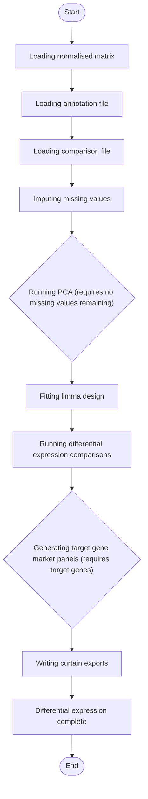

# Total Proteomics Differential Expression


## Installation

**[⬇️ Click here to install in Cauldron](http://localhost:50060/install?repo=https%3A%2F%2Fgithub.com%2Fnoatgnu%2Ftotal-proteomics-differential-expression-plugin)** _(requires Cauldron to be running)_

> **Repository**: `https://github.com/noatgnu/total-proteomics-differential-expression-plugin`

**Manual installation:**

1. Open Cauldron
2. Go to **Plugins** → **Install from Repository**
3. Paste: `https://github.com/noatgnu/total-proteomics-differential-expression-plugin`
4. Click **Install**

**ID**: `total-proteomics-differential-expression`  
**Version**: 1.0.0  
**Category**: analysis  
**Author**: CauldronGO Team

## Description

Group-wise or Perseus-default imputation and limma differential expression for normalised total proteomics data


## Workflow Diagram



## Runtime

- **Environments**: `r`

- **Entrypoint**: `total_proteomics_differential_expression.R`

## Inputs

| Name | Label | Type | Required | Default | Visibility |
|------|-------|------|----------|---------|------------|
| `normalized_matrix_file` | Normalised Matrix File | file | Yes | - | Always visible |
| `annotation_file` | Sample Annotation File | file | Yes | - | Always visible |
| `comparison_file` | Comparison File | file | Yes | - | Always visible |
| `impute_method` | Imputation Method | select (none, group_downshift, perseus_default) | No | none | Always visible |
| `impute_downshift` | Imputation Downshift (SD units) | number (min: 0, step: 0) | No | 1.8 | Always visible |
| `impute_width` | Imputation Width (SD units) | number (min: 0, step: 0) | No | 0.3 | Always visible |
| `fdr_cutoff` | FDR Cutoff | number (min: 0, max: 1, step: 0) | No | 0.05 | Always visible |
| `fc_threshold_log2` | Log2 Fold Change Threshold | number (min: 0, step: 0) | No | 0.585 | Always visible |
| `target_genes` | Target Genes (comma-separated) | text | No | - | Always visible |
| `top_n_genes` | Top Genes per Direction | number (min: 1, step: 1) | No | 15 | Always visible |

### Input Details

#### Normalised Matrix File (`normalized_matrix_file`)

One of the QC & Normalisation plugin's normalized_<method>.tsv outputs (Protein.Group, Genes, primary_gene, Category, then one column per sample)


#### Sample Annotation File (`annotation_file`)

Cauldron sample annotation file. Sample is matched against the matrix's sample columns by exact string, falling back to basename.

- **Table Editor**: Enabled with 3 columns
  - **Columns**:
    - `Sample`: Sample (required)
      - Sample identifier matching a normalised-matrix column (full raw-file path or basename)
    - `Condition`: Condition (required)
      - Experimental group label
    - `BioReplicate`: BioReplicate
      - Biological replicate identifier (optional)

#### Comparison File (`comparison_file`)

Pairwise comparisons: columns condition_A, condition_B, comparison_label. Positive log2FC means condition_A > condition_B.


#### Imputation Method (`impute_method`)

'group_downshift' pools each Condition group's own samples to compute one mean/sd, then downshifts (group-wise, MNAR-aware). 'perseus_default' computes mean/sd separately for each sample column, matching Perseus's own default mode. 'none' leaves missing values as-is.

- **Options**: `none`, `group_downshift`, `perseus_default`

#### Imputation Downshift (SD units) (`impute_downshift`)

How far below the observed mean to centre imputed values, in standard deviations. Perseus default: 1.8.


#### Imputation Width (SD units) (`impute_width`)

Width of the imputed-value distribution, as a fraction of the observed standard deviation. Perseus default: 0.3.


#### FDR Cutoff (`fdr_cutoff`)

Adjusted p-value (BH) threshold for significance


#### Log2 Fold Change Threshold (`fc_threshold_log2`)

Minimum |log2 fold change| for significance (default 0.585 = log2(1.5))


#### Target Genes (comma-separated) (`target_genes`)

Optional gene symbols always labelled on every volcano plot and given their own marker abundance panel, regardless of significance. Leave empty to skip marker panels.


#### Top Genes per Direction (`top_n_genes`)

Number of top up- and down-regulated genes shown in the per-comparison top-genes bar chart


## Outputs

| Name | File | Type | Format | Description |
|------|------|------|--------|-------------|
| `differential_results_all` | `DE/DE_all_contrasts.xlsx` | data | xlsx | Multi-sheet Excel workbook, one sheet per comparison |
| `de_summary_plot` | `DE/DE_up_down_by_contrast.png` | plot | png | Significant proteins up/down, summarised across all comparisons |
| `pca_plot` | `DE/PCA_after_imputation.png` | plot | png | PCA of the (imputed, if requested) intensity matrix |
| `target_markers_plot` | `DE/target_markers_panel.png` | plot | png | Per-gene abundance panel for Target Genes, one facet per gene. Present only when target_genes is set. |
| `curtain_intensity_matrix` | `curtain/curtain_intensity_matrix.tsv` | data | tsv | Intensity matrix in Curtain's expected column format (Protein IDs, Gene names, ...) |

## Requirements

- **R Version**: >=4.0

### R Dependencies (External File)

Dependencies are defined in: `r-packages.txt`

- `SummarizedExperiment`
- `limma`
- `tidyverse`
- `ggplot2`
- `ggrepel`
- `patchwork`
- `pheatmap`
- `svglite`
- `scales`
- `writexl`

> **Note**: When you create a custom environment for this plugin, these dependencies will be automatically installed.

## Example Data

This plugin includes example data for testing:

```yaml
  annotation_file: examples/annotation.txt
  comparison_file: examples/comparison.txt
  impute_method: group_downshift
  normalized_matrix_file: examples/normalized_matrix.tsv
```

Load example data by clicking the **Load Example** button in the UI.

## Usage

### Via UI

1. Navigate to **analysis** → **Total Proteomics Differential Expression**
2. Fill in the required inputs
3. Click **Run Analysis**

### Via Plugin System

```typescript
const jobId = await pluginService.executePlugin('total-proteomics-differential-expression', {
  // Add parameters here
});
```
